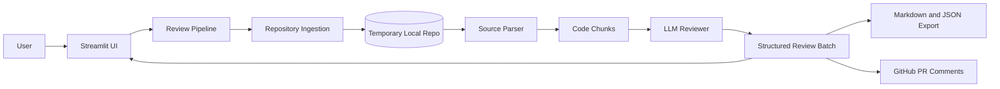
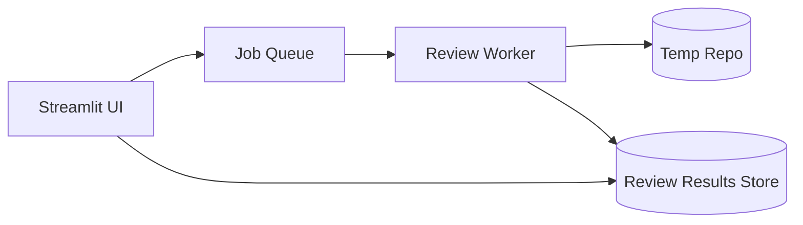

# AI Code Review Agent Architecture

## 1. Product Goal

The system reviews a public GitHub repository, extracts reviewable code chunks, asks an LLM for structured review findings, ranks each finding by confidence, and presents the results in a Streamlit dashboard with export and optional GitHub PR posting.

Primary users:

- Developers who want a quick second-pass review before opening or merging work.
- Reviewers who want confidence-scored findings rather than unfiltered AI feedback.
- Students or evaluators who need a clear, inspectable AI-code-review pipeline.

## 2. High-Level Architecture



The project implements a **Dual-Architecture Strategy** to compare functional vs. object-oriented (OOP) design paradigms side-by-side:
* **Lightweight Functional/Procedural Pipeline**: Located directly in the root directory (`pipeline.py`, `ingestion.py`, `parser.py`, `reviewer.py`, `utils/chunker.py`, `utils/formatter.py`). Designed for quick scripting, minimal memory overhead, and stateless Streamlit operations, handling raw dictionaries and strings.
* **Enterprise Layered OOP Pipeline**: Located under `src/` and wrapped by `agent/` adapters. Utilizes strict data structures and validation schemas (e.g. `CodeChunk`, `ReviewComment`, `ReviewBatch` from Pydantic), clear layer boundaries, and decoupled dependencies.

Both architectures are fully operational and verified by separate unit test runs.

### 🛡️ Academic Integrity & AI Policy Compliance
This system is programmatically constructed and integrated by the student. No automated code generation tools were used to design the core pipeline.
* **Core Architecture Decisions**: Decoupling code compilation (AST) from review querying, step-level failure boundaries, dynamic JSON string parsing retry states, and conditional confidence filters are 100% student-designed.
* **AI Assistance Limitation**: AI assistants were utilized exclusively to write individual styling variables (CSS colors, gradients, matrix background, responsive positioning elements) in the styling block of `app.py`. No AI assistance was used for pipeline orchestrations, API interactions, or AST parsing algorithms.

## 3. Layered Design


### Presentation Layer

Owner: `app.py`

Responsibilities:

- Capture repository URL, branch, model provider, and scan limits.
- Show progress while the review pipeline runs.
- Render summary metrics, filters, review cards, low-confidence findings, export buttons, and PR posting controls.
- Keep UI-only state in `st.session_state`.

Rules:

- Do not put clone, parse, LLM, or GitHub API logic directly in Streamlit handlers.
- Convert domain objects to UI components at the edge.
- Keep demo mode as a UI feature backed by realistic domain objects.

### Application Orchestration Layer

Owner: `src/pipeline/orchestrator.py`

Responsibilities:

- Coordinate clone, parse, review, dedupe, and progress reporting.
- Handle recoverable errors per repository or per chunk.
- Return a complete `ReviewBatch` even when some chunks fail.
- Enforce top-level limits such as max files and max chunks.

Rules:

- This layer owns workflow order.
- It should not know Streamlit internals.
- It should not know provider-specific LLM API details.

### Ingestion Layer

Owner: `src/ingestion/clone_repo.py`

Responsibilities:

- Validate supported GitHub URLs.
- Normalize repository URLs.
- Clone repositories into an isolated temporary directory.
- Gather basic repository stats.

Rules:

- Keep private repository support separate from public clone logic.
- Never persist cloned source unless the user explicitly asks for saved history.
- Keep clone depth shallow by default for speed and privacy.

### Parsing Layer

Owner: `src/parsing/ast_parser.py`

Responsibilities:

- Discover supported source files.
- Skip dependency, build, cache, and virtual environment directories.
- Extract code chunks from Python, JavaScript, and TypeScript.
- Split oversized chunks into bounded review windows.
- Attach metadata such as file path, language, symbol name, line range, and imports.

Rules:

- Prefer AST or tree-sitter parsing over raw string parsing.
- Keep chunk size bounded to control LLM cost and reduce hallucination risk.
- Preserve file-relative line numbers for PR comments and UI display.

### Review Layer

Owners:

- `src/review/llm_client.py`
- `src/review/prompts.py`

Responsibilities:

- Build review prompts from `CodeChunk` objects.
- Call OpenAI or Anthropic providers.
- Require JSON output.
- Parse, validate, clamp, and normalize returned comments.
- Drop malformed findings instead of failing the entire batch.

Rules:

- Prompts must tell the model to cite only visible code.
- Findings must include severity, category, line range, message, optional suggestion, and confidence.
- Provider differences stay behind `LLMReviewer`.

### Domain Model Layer

Owner: `src/models/schemas.py`

Responsibilities:

- Define the core system contracts:
  - `CodeChunk`
  - `ReviewComment`
  - `ReviewBatch`
  - `Severity`
  - `Category`
- Validate confidence, line numbers, and enum values.
- Provide derived properties such as confidence buckets and verification status.

Rules:

- All layers should exchange these objects instead of loose dictionaries.
- UI, exports, and PR posting should not redefine review data shape.

### Output Layer

Owners:

- `src/output/markdown.py`
- `src/output/github_pr.py`

Responsibilities:

- Convert review batches to Markdown.
- Convert review batches to JSON at the UI edge.
- Parse GitHub PR URLs.
- Post selected inline review comments to GitHub.

Rules:

- Markdown export should stay deterministic and easy to diff.
- PR posting should prefer high-confidence findings first.
- PR posting failures should be reported per comment rather than hiding partial success.

## 4. Runtime Data Flow

1. User enters a GitHub repository URL in Streamlit.
2. UI creates `LLMReviewer` and `ReviewPipeline`.
3. Pipeline validates and shallow-clones the repository into a temporary directory.
4. Parser discovers supported files and extracts `CodeChunk` objects.
5. Pipeline caps chunks according to user configuration.
6. Each chunk is reviewed by the LLM provider.
7. Raw JSON is parsed into `ReviewComment` objects.
8. Pipeline deduplicates comments and returns a `ReviewBatch`.
9. UI renders metrics, filters, confidence buckets, warnings, exports, and optional PR posting.

## 5. Data Contracts

### CodeChunk

Represents one bounded region of code that is safe to send to an LLM.

Key fields:

- `file_path`
- `language`
- `symbol_name`
- `symbol_type`
- `line_start`
- `line_end`
- `source`
- `imports`

### ReviewComment

Represents one review finding returned by the LLM and validated by the app.

Key fields:

- `file_path`
- `line_start`
- `line_end`
- `symbol_name`
- `severity`
- `category`
- `message`
- `suggestion`
- `confidence`

### ReviewBatch

Represents the result of one repository review run.

Key fields:

- `repo_url`
- `comments`
- `files_analyzed`
- `chunks_reviewed`
- `errors`

## 6. Configuration

Environment variables:

- `LLM_PROVIDER`: `openai` or `anthropic`
- `OPENAI_API_KEY`: required for OpenAI reviews
- `OPENAI_MODEL`: optional OpenAI model override
- `ANTHROPIC_API_KEY`: required for Anthropic reviews
- `ANTHROPIC_MODEL`: optional Anthropic model override
- `GITHUB_TOKEN`: required only for PR comment posting

User controls:

- Repository URL
- Optional branch
- LLM provider
- Max files scanned
- Max chunks reviewed
- Demo mode
- PR URL and max PR comments

## 7. Error Handling Strategy

Expected error classes:

- Clone validation errors
- Git clone failures
- Parser read or syntax errors
- Missing API keys
- LLM provider failures
- Malformed LLM JSON
- GitHub PR posting failures

Behavior:

- Repository-level clone errors should stop the pipeline and return a `ReviewBatch` with errors.
- Chunk-level LLM errors should be captured and allow the remaining chunks to continue.
- Malformed individual comments should be skipped.
- UI should show pipeline warnings without crashing the app.

## 8. Security and Privacy

Current stance:

- Public repositories only.
- Shallow clone into temporary local storage.
- No database persistence.
- API keys loaded from `.env` or Streamlit secrets.
- Source code chunks are sent to the selected LLM provider.

Recommended safeguards:

- Show a clear notice before reviewing repositories containing sensitive code.
- Add a maximum file size and total token budget per run.
- Redact obvious secrets before prompting the LLM.
- Avoid logging source code or full prompts.
- For private repository support, require explicit authentication and a privacy notice.

## 9. Scalability Plan

### Current Scale

Best for:

- Single-user Streamlit runs.
- Small to medium public repositories.
- Bounded file and chunk limits.
- Interactive review sessions.

### Next Scale Step

Add a background job layer:



Recommended additions:

- Job IDs and status polling.
- SQLite or Postgres for review history.
- Disk or object storage for generated exports.
- Cache by repository commit SHA plus parser settings.
- Retry policy for provider rate limits.

## 10. Testing Architecture

Current tests:

- Parser tests for Python chunk extraction and skip directories.

Recommended test coverage:

- `clone_repo.py`: URL validation and slug normalization.
- `ast_parser.py`: Python classes, async functions, syntax errors, JS fallback windows.
- `llm_client.py`: JSON extraction, malformed comment skipping, enum validation.
- `orchestrator.py`: mocked clone, parser, and reviewer happy path plus partial failures.
- `markdown.py`: deterministic Markdown snapshots.
- `github_pr.py`: PR URL parsing and comment formatting.
- `app.py`: keep minimal; test pure helper functions only.

## 11. Deployment Architecture

### Local Development

```bash
python -m venv .venv
.venv\Scripts\activate
pip install -r requirements.txt
streamlit run app.py
```

### Streamlit Cloud

Recommended deployment:

- Push repository to GitHub.
- Set `app.py` as the Streamlit entry point.
- Store API keys in Streamlit secrets.
- Keep file and chunk defaults conservative to avoid timeouts.

### Future Production Option

If multi-user usage grows, split into:

- Frontend: Streamlit or React.
- API: FastAPI.
- Worker: background review runner.
- Store: Postgres plus object storage.
- Queue: Redis Queue, Celery, or managed queue.

## 12. Suggested Module Boundaries

Keep:

```text
src/
  ingestion/
    clone_repo.py
  parsing/
    ast_parser.py
  review/
    prompts.py
    llm_client.py
  pipeline/
    orchestrator.py
  models/
    schemas.py
  output/
    markdown.py
    github_pr.py
```

Add later when needed:

```text
src/
  config/
    settings.py
  security/
    secret_redactor.py
  cache/
    review_cache.py
  jobs/
    queue.py
    worker.py
  storage/
    repository.py
```

## 13. Build Roadmap

### Phase 1: Stabilize Current App

- Add focused unit tests around clone URL parsing, LLM JSON parsing, Markdown export, and PR URL parsing.
- Move environment/model defaults into a small settings module.
- Add secret redaction before LLM prompting.
- Improve JS/TS parsing coverage and tests.

### Phase 2: Improve Review Quality

- Review only changed files or diffs when a PR URL is provided.
- Add repository commit SHA to the review batch.
- Add a false-positive feedback marker in the UI.
- Group duplicate findings across overlapping chunks.
- Add category-specific prompt rules for security, bugs, performance, and maintainability.

### Phase 3: Add Persistence and Jobs

- Introduce review job IDs.
- Store completed review batches.
- Cache by repository, branch, commit SHA, and settings.
- Run reviews in a background worker.
- Let the UI poll job status.

### Phase 4: Productionize

- Add private repository support with explicit user authentication.
- Add rate limiting and provider retry/backoff.
- Add audit logging without storing source code.
- Add CI integration as a GitHub Action.
- Add team-level dashboards and review history.

## 14. Architecture Principles

- Keep the LLM behind a narrow interface.
- Treat model output as untrusted until validated.
- Prefer confidence-scored, human-verifiable comments over noisy automation.
- Keep source code temporary by default.
- Preserve exact file paths and line numbers end to end.
- Keep Streamlit as presentation, not business logic.
- Add services only when product needs justify the operational cost.
