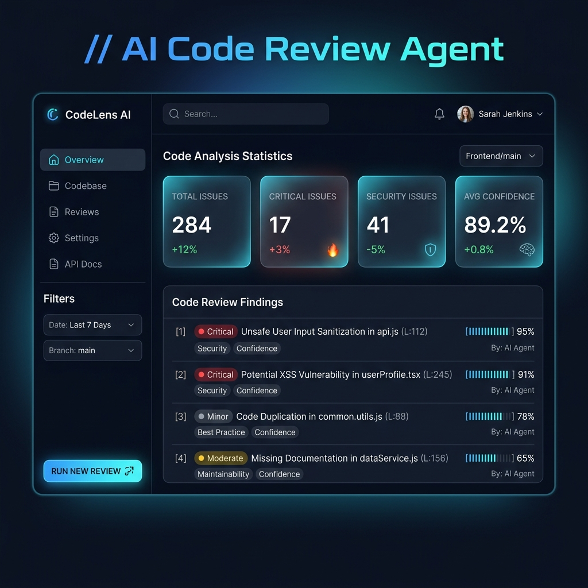

# AI Code Review Agent

<div align="center">

[](https://ai-code-reviewer-vtktnacbukrw87589atwck.streamlit.app/)
[](https://www.python.org/)
[](https://opensource.org/licenses/MIT)

<h3>⚡ Try the Live Dashboard Instantly ⚡</h3>

No installation required! Scan any public GitHub repository directly from your browser.

[](https://ai-code-reviewer-vtktnacbukrw87589atwck.streamlit.app/)

👉 **[Launch AI Code Reviewer Live](https://ai-code-reviewer-vtktnacbukrw87589atwck.streamlit.app/)** 👈

</div>

> [!IMPORTANT]
> ### 🌐 Developer Portfolio: Sentinel Complete Site
> **Must Visit**: Check out the developer's full showcase and project portfolio at **[Sentinel Complete Site](https://sentinel-complete-site--nikhil19102004.replit.app/)** to explore more advanced software engineering systems, tools, and visual dashboards.
> 
> *⚠️ Note: This hosting deployment is temporary and will remain active until **June 20, 2026**.*


An autonomous repository review agent that clones public GitHub repositories, performs AST-based Python code parsing, slices code into logical chunks, and generates confidence-rated review findings using LLMs. The results are displayed in a clean, filterable Streamlit dashboard.

The creative twist of this agent is its dynamic confidence scoring system. Every finding generated by the LLM includes a self-reported confidence percentage. Low-confidence findings (below 50%) are grouped and labeled with a warning badge ("verify this"), alerting users to verify the findings manually before taking action.

## Architecture Diagram

```
+------------+     +--------------+     +-----------+     +------------+     +-------------+     +--------+
| GitHub URL | --> | ingestion.py | --> | parser.py | --> | chunker.py | --> | reviewer.py | --> | app.py |
+------------+     +--------------+     +-----------+     +------------+     +-------------+     +--------+
```

## Setup Instructions

Run the following commands to install and start the agent:

```bash
# Initialize and activate the virtual environment
python -m venv .venv && source .venv/bin/activate

# Install dependencies
pip install -r requirements.txt

# Configure environment variables (add your ANTHROPIC_API_KEY or OPENAI_API_KEY)
cp .env.example .env

# Launch the Streamlit dashboard
streamlit run app.py
```

## Environment Variables

Configure the following variables in your `.env` file:

| Variable | Allowed Values | Description |
|---|---|---|
| `ANTHROPIC_API_KEY` | str | API key for Anthropic Claude models. |
| `LLM_PROVIDER` | `openai` \| `anthropic` | The LLM provider API to call for code reviews. |
| `LLM_MODEL` | str | The model identifier to use (e.g. `gpt-4o-mini`, `claude-3-5-sonnet-latest`). |

## Known Limitations

- **JavaScript Files**: Chunked by raw lines rather than AST parsing (no deep AST structure analyzed for JS/TS).
- **API Rate Limits**: Scanning very large repositories can hit LLM rate limits due to high token volumes.
- **Confidence Scores**: Ratings are self-reported by the LLM and are subject to estimation biases.

## 🚀 Feature Roadmap & Ideas (Open for Contributions!)

This project is open-source and welcomes contributions! Here are some of the exciting features and enhancements we would love to see built next:

- **🔌 GitHub Action / PR Integration**: Create a GitHub Action that runs on pull requests, parses modifications, and posts inline review comments directly to the PR diff.
- **🌳 Tree-sitter Grammars**: Add robust parser support for JavaScript, TypeScript, Go, and Rust by compiling and loading Tree-sitter grammars.
- **⚡ Review Caching Layer**: Implement a local SQLite caching system tracking file checksums to skip LLM analysis on files that haven't changed.
- **🧠 Vector RAG (Chat with Code)**: Embed AST chunks into a vector database (e.g., ChromaDB) to allow users to ask general architectural questions about the repository.
- **📋 Custom Rubrics & Linting Rules**: Allow users to supply their own review guidelines or code standards as markdown rules files.
- **🤖 Local LLM Support**: Integrate Ollama/Llama.cpp to enable offline code reviews using local models like Llama-3 or Mistral.

---

## 🤝 How to Contribute

Contributions are what make the open source community such an amazing place to learn, inspire, and create. Any contributions you make are **greatly appreciated**.

### 1. Fork the Project
Click the "Fork" button at the top-right of this repository to create your own copy of the codebase.

### 2. Clone and Setup Branch
```bash
# Clone your fork
git clone https://github.com/YOUR_USERNAME/ai-code-reviewer.git
cd ai-code-reviewer

# Create a feature branch
git checkout -b feature/amazing-feature
```

### 3. Run Verification Tests
Before writing any code or opening a PR, ensure the local environment works perfectly:
```bash
# Run pytest unit tests
pytest --ignore=scratch --ignore=smoke_test.py

# Run the end-to-end integration smoke test
python smoke_test.py
```

### 4. Commit and Push
Ensure your commit messages follow a clean standard (e.g., `feat: ...`, `fix: ...`, `docs: ...`):
```bash
# Stage changes
git add .

# Commit changes
git commit -m "feat: add support for local Ollama reviews"

# Push to your feature branch
git push origin feature/amazing-feature
```

### 5. Open a Pull Request
Go to the original repository and click **New Pull Request** to submit your changes for review!
