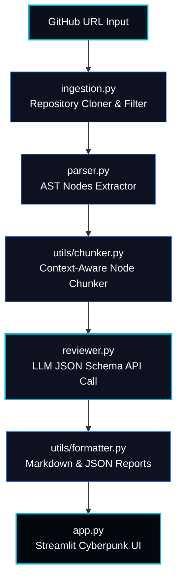

# 🤖 CodeLens AI: Autonomous AST-Aware Code Reviewer

<div align="center">

[](https://ai-code-reviewer-vtktnacbukrw87589atwck.streamlit.app/)
[](https://sentinel-complete-site--nikhil19102004.replit.app/)
[](https://www.python.org/)
[](https://opensource.org/licenses/MIT)

<h3>⚡ Try the Live Review Dashboard & Showcase Website ⚡</h3>

Scan public GitHub repositories instantly in the web dashboard, or explore the professional showcase.

👉 **[Launch AI Code Reviewer Dashboard](https://ai-code-reviewer-vtktnacbukrw87589atwck.streamlit.app/)** 👈

👉 **[Explore the Sentinel Product Landing Page](https://sentinel-complete-site--nikhil19102004.replit.app/)** 👈

</div>

---

> [!NOTE]
> ### 🌐 Developer Showcase: Sentinel Complete Site
> Check out the developer's full portfolio, landing page, and project showcase at **[Sentinel Complete Site](https://sentinel-complete-site--nikhil19102004.replit.app/)**. Experience the futuristic product presentation designed to highlight core capabilities, workflows, and integrations.
> 
> *⚠️ Disclaimer: This portfolio site is temporarily hosted on Replit and will remain active until **June 20, 2026**. Please visit the site before then to inspect the design showcase.*

<div align="center">
  
  <p><i>Figure 1: The Sentinel Product Landing Page - Professional product presentation</i></p>
</div>

---

## 📋 Project Overview

**CodeLens AI** (commercially branded as **Sentinel**) is an autonomous repository analysis agent that automates python and javascript/typescript code reviews. The agent clones public GitHub repositories, builds Abstract Syntax Tree (AST) representations of Python source code, groups them into logical class and function-level chunks, runs deep LLM review iterations using state-of-the-art models (Groq, OpenAI, Anthropic), and produces confidence-rated, schema-validated review findings.

The twist of CodeLens AI is its **interactive confidence scoring mechanism**. Every review finding is returned with a self-assessed confidence rating. The dashboard automatically filters, groups, and tags findings:
* **High Confidence (>= 50%)**: Displayed on the main review panel with progress indicators.
* **Low Confidence (< 50%)**: Segmented into a warning drawer ("Needs Verification") to alert developers that manual verification is needed before acting on the suggestion.

---

## 🏗️ System Architecture

CodeLens AI utilizes a modular pipelined architecture to execute AST-guided reviews.



### Module Descriptions
1. **Repository Ingestion (`ingestion.py`)**: Clones the public repository to a local temporary directory, traverses files, filters source extensions (Python, JavaScript), and limits file count and sizes to prevent runtime overhead.
2. **AST Parser (`parser.py`)**: Compiles Python source code into a programmatic Abstract Syntax Tree, cataloging classes, functions, and import references.
3. **Context Chunker (`utils/chunker.py`)**: Slices the parser's AST classes and functions into token-efficient text chunks so that each LLM query has exact structural context without exceeding API token limits.
4. **LLM Reviewer (`reviewer.py`)**: Submits the code chunks to the configured LLM API (Groq, OpenAI, Anthropic) using a system prompt that mandates strict JSON output conforming to our custom schema.
5. **Dashboard UI (`app.py`)**: Renders a visually premium Streamlit web app themed with grid overlays, scrolling scanlines, glowing metric cards, interactive details draw-downs, and a live codebase file explorer.

---

## ⚡ Setup & Installation

Follow these steps to run the CodeLens AI developer environment locally:

### 1. Prerequisites
Ensure you have **Python 3.9 or higher** and `git` installed on your system.

### 2. Clone the Repository
```bash
git clone https://github.com/nikhilc1910/ai-code-reviewer.git
cd ai-code-reviewer
```

### 3. Setup Virtual Environment
On Windows (PowerShell):
```powershell
python -m venv .venv
.venv\Scripts\Activate.ps1
```
On Linux/macOS:
```bash
python -m venv .venv
source .venv/bin/activate
```

### 4. Install Dependencies
```bash
pip install -r requirements.txt
```

### 5. Configure Environment Variables
Copy the `.env.example` file and add your credentials:
```bash
cp .env.example .env
```
Open `.env` and fill in your keys:
```env
# Selected review provider (groq, openai, anthropic)
LLM_PROVIDER=groq
LLM_MODEL=llama-3.1-8b-instant

# API Credentials
GROQ_API_KEY=your_groq_api_key_here
OPENAI_API_KEY=your_openai_api_key_here
ANTHROPIC_API_KEY=your_anthropic_api_key_here
```

### 6. Run the Application
Launch the Streamlit web dashboard locally:
```bash
streamlit run app.py
```

---

## 🧪 Verification & Testing Suite

CodeLens AI includes a robust suite of tests to verify pipeline operations before deployment.

### Run Unit Tests
To run unit tests for chunking, parser, ingestion, and reviewer modules:
```bash
python -m pytest tests/
```

### Run End-to-End Integration Smoke Test
Execute a full simulated pipeline test that clones a sample repository, parses nodes, chunks code, invokes the LLM API, formats output, and validates schemas:
```bash
python smoke_test.py
```

---

## ⚠️ Known Limitations

* **AST Language Constraints**: Deep Abstract Syntax Tree node analysis is currently only implemented for **Python**. JavaScript and TypeScript files are ingested and chunked using line-based boundaries instead of language-specific AST tokens.
* **Token Rate Limits**: Highly complex repositories containing hundreds of large files can occasionally trigger LLM rate limits. Use the sidebar category filters and size boundaries to reduce context load.
* **LLM Bias**: Confidence scores are self-assessed by the LLM prompt completion, which means scores may exhibit over-confidence or hallucinations depending on the selected provider model.
* **Public Repo Only**: The ingestion engine currently clones via public HTTP links and does not support OAuth/SSH private key repository authentication out-of-the-box.

---

## 🚀 Future Roadmap: What We'd Build Next

With more development cycles, we would prioritize building the following value-add features:

1. **🔌 Inline GitHub PR Review Actions**:
   Create a GitHub Action integration that triggers on Pull Requests. Instead of checking out the repo manually, it would analyze only the modified diff lines, map them back to the AST block, and post inline comments directly on the PR code review page.
2. **🌳 Multi-Language Tree-sitter Support**:
   Compile and integrate Tree-sitter grammars (via `py-tree-sitter`) to replace line-based chunking for JavaScript, TypeScript, Go, Rust, and C++ with full AST parsing support.
3. **⚡ Incremental File Caching**:
   Add a local SQLite-backed caching system that calculates SHA-256 hashes of files. On subsequent scans, only modified files are sent to the LLM, reducing API costs and scan times by up to 90%.
4. **🧠 Vector RAG Codebase Assistant**:
   Vectorize all parsed AST chunks using an embedding model and load them into a vector database (e.g. ChromaDB). This would add a "Chat with Codebase" panel, allowing developers to ask conversational questions about the repository's design patterns and software architectures.
5. **📋 Custom Style Rubrics**:
   Allow teams to supply their own markdown-based style guides or secure coding templates, injecting them into the reviewer's prompt context to enforce custom, team-specific engineering rules.

---

## 🤝 Contributing Guidelines

Contributions are welcome! Here is how you can help add features and get commits merged:

### 1. Fork and Clone
Click **Fork** on GitHub and clone your fork repository:
```bash
git clone https://github.com/YOUR_USERNAME/ai-code-reviewer.git
cd ai-code-reviewer
git checkout -b feature/your-awesome-feature
```

### 2. Verify Your Environment
Always ensure existing tests pass before starting development:
```bash
python -m pytest tests/
python smoke_test.py
```

### 3. Implement Your Changes
* Retain original docstrings and comments.
* Write unit tests in the `tests/` directory for any new module or helper function.

### 4. Run Pre-commit Verification
Before committing, ensure your styling is clean and all 84+ unit tests and 7 integration steps are completely green:
```bash
python -m pytest tests/
python smoke_test.py
```

### 5. Commit and Push
```bash
git add .
git commit -m "feat: add tree-sitter chunking for javascript"
git push origin feature/your-awesome-feature
```
Open a **Pull Request** on the main repository describing your feature, findings, and verification runs!
