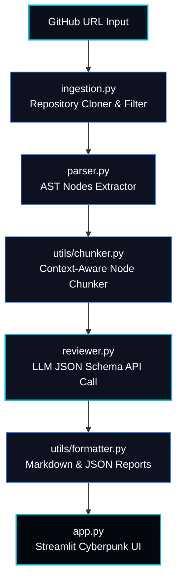

# 🤖 CodeLens AI: Autonomous AST-Aware Code Reviewer

<div align="center">

[](https://ai-code-reviewer-vtktnacbukrw87589atwck.streamlit.app/)
[](https://sentinel-complete-site--nikhil19102004.replit.app/)
[](https://www.python.org/)
[](https://opensource.org/licenses/MIT)

<h3>⚡ Try the Live Review Dashboard & Showcase Website ⚡</h3>

Scan public GitHub repositories instantly in the web dashboard, or explore the professional showcase.

👉 **[Launch AI Code Reviewer Dashboard](https://ai-code-reviewer-vtktnacbukrw87589atwck.streamlit.app/)** 👈

👉 **[Explore the Sentinel Product Landing Page](https://sentinel-complete-site--nikhil19102004.replit.app/)** 👈

</div>

---

> [!NOTE]
> ### 🌐 Developer Showcase: Sentinel Complete Site
> Check out the developer's full portfolio, landing page, and project showcase at **[Sentinel Complete Site](https://sentinel-complete-site--nikhil19102004.replit.app/)**. Experience the futuristic product presentation designed to highlight core capabilities, workflows, and integrations.
> 
> *⚠️ Disclaimer: This portfolio site is temporarily hosted on Replit and will remain active until **June 20, 2026**. Please visit the site before then to inspect the design showcase.*

<div align="center">
  
  <p><i>Figure 1: The Sentinel Product Landing Page - Professional product presentation</i></p>
</div>

---

## 📋 Project Overview

**CodeLens AI** (commercially branded as **Sentinel**) is an autonomous repository analysis agent that automates python and javascript/typescript code reviews. The agent clones public GitHub repositories, builds Abstract Syntax Tree (AST) representations of Python source code, groups them into logical class and function-level chunks, runs deep LLM review iterations using state-of-the-art models (Groq, OpenAI, Anthropic), and produces confidence-rated, schema-validated review findings.

The twist of CodeLens AI is its **interactive confidence scoring mechanism**. Every review finding is returned with a self-assessed confidence rating. The dashboard automatically filters, groups, and tags findings:
* **High Confidence (>= 50%)**: Displayed on the main review panel with progress indicators.
* **Low Confidence (< 50%)**: Segmented into a warning drawer ("Needs Verification") to alert developers that manual verification is needed before acting on the suggestion.

---

## 🏗️ System Architecture

CodeLens AI utilizes a modular pipelined architecture to execute AST-guided reviews.



### Module Descriptions
1. **Repository Ingestion (`ingestion.py`)**: Clones the public repository to a local temporary directory, traverses files, filters source extensions (Python, JavaScript), and limits file count and sizes to prevent runtime overhead.
2. **AST Parser (`parser.py`)**: Compiles Python source code into a programmatic Abstract Syntax Tree, cataloging classes, functions, and import references.
3. **Context Chunker (`utils/chunker.py`)**: Slices the parser's AST classes and functions into token-efficient text chunks so that each LLM query has exact structural context without exceeding API token limits.
4. **LLM Reviewer (`reviewer.py`)**: Submits the code chunks to the configured LLM API (Groq, OpenAI, Anthropic) using a system prompt that mandates strict JSON output conforming to our custom schema.
5. **Dashboard UI (`app.py`)**: Renders a visually premium Streamlit web app themed with grid overlays, scrolling scanlines, glowing metric cards, interactive details draw-downs, and a live codebase file explorer.

---

## ⚡ Setup & Installation

Follow these steps to run the CodeLens AI developer environment locally:

### 1. Prerequisites
Ensure you have **Python 3.9 or higher** and `git` installed on your system.

### 2. Clone the Repository
```bash
git clone https://github.com/nikhilc1910/ai-code-reviewer.git
cd ai-code-reviewer
```

### 3. Setup Virtual Environment
On Windows (PowerShell):
```powershell
python -m venv .venv
.venv\Scripts\Activate.ps1
```
On Linux/macOS:
```bash
python -m venv .venv
source .venv/bin/activate
```

### 4. Install Dependencies
```bash
pip install -r requirements.txt
```

### 5. Configure Environment Variables
Copy the `.env.example` file and add your credentials:
```bash
cp .env.example .env
```
Open `.env` and fill in your keys:
```env
# Selected review provider (groq, openai, anthropic)
LLM_PROVIDER=groq
LLM_MODEL=llama-3.1-8b-instant

# API Credentials
GROQ_API_KEY=your_groq_api_key_here
OPENAI_API_KEY=your_openai_api_key_here
ANTHROPIC_API_KEY=your_anthropic_api_key_here
```

### 6. Run the Application
Launch the Streamlit web dashboard locally:
```bash
streamlit run app.py
```

### 7. Dry Running with Preset Repositories
To test the application quickly, we have provided a set of diverse preset repositories. You can either select these from the "Quick Test Presets" dropdown menu in the sidebar of the live dashboard to autofill the URL, or copy and paste them directly:

* **Best Overall Test Repo**: `https://github.com/pypa/sampleproject`
  * *Perfect for*: Smoke testing, UI demo, and fast review generation.
* **Tiny Python Repo**: `https://github.com/octocat/Hello-World`
  * *Perfect for*: Extremely small codebase and near-instant review generation.
* **Small Flask App**: `https://github.com/pallets/flask/tree/main/examples/tutorial`
  * *Perfect for*: Realistic security, performance, and coding style findings.
* **Small FastAPI Repo**: `https://github.com/fastapi/fastapi/tree/master/docs_src/first_steps`
  * *Perfect for*: Testing reviews on a modern Python framework environment.
* **JavaScript Small Repo**: `https://github.com/vercel/ms`
  * *Perfect for*: Checking line-based chunk reviewing on JavaScript source files.

---

## 🧪 Verification & Testing Suite

CodeLens AI includes a robust suite of tests to verify pipeline operations before deployment.

### Run Unit Tests
To run unit tests for chunking, parser, ingestion, and reviewer modules:
```bash
python -m pytest tests/
```

### Run End-to-End Integration Smoke Test
Execute a full simulated pipeline test that clones a sample repository, parses nodes, chunks code, invokes the LLM API, formats output, and validates schemas:
```bash
python smoke_test.py
```

---

## ⚠️ Known Limitations

* **AST Language Constraints**: Deep Abstract Syntax Tree node analysis is currently only implemented for **Python**. JavaScript and TypeScript files are ingested and chunked using line-based boundaries instead of language-specific AST tokens.
* **Token Rate Limits**: Highly complex repositories containing hundreds of large files can occasionally trigger LLM rate limits. Use the sidebar category filters and size boundaries to reduce context load.
* **LLM Bias**: Confidence scores are self-assessed by the LLM prompt completion, which means scores may exhibit over-confidence or hallucinations depending on the selected provider model.
* **Public Repo Only**: The ingestion engine currently clones via public HTTP links and does not support OAuth/SSH private key repository authentication out-of-the-box.

---

## 🚀 Future Roadmap: What We'd Build Next

With more development cycles, we would prioritize building the following value-add features:

1. **🔌 Inline GitHub PR Review Actions**:
   Create a GitHub Action integration that triggers on Pull Requests. Instead of checking out the repo manually, it would analyze only the modified diff lines, map them back to the AST block, and post inline comments directly on the PR code review page.
2. **🌳 Multi-Language Tree-sitter Support**:
   Compile and integrate Tree-sitter grammars (via `py-tree-sitter`) to replace line-based chunking for JavaScript, TypeScript, Go, Rust, and C++ with full AST parsing support.
3. **⚡ Incremental File Caching**:
   Add a local SQLite-backed caching system that calculates SHA-256 hashes of files. On subsequent scans, only modified files are sent to the LLM, reducing API costs and scan times by up to 90%.
4. **🧠 Vector RAG Codebase Assistant**:
   Vectorize all parsed AST chunks using an embedding model and load them into a vector database (e.g. ChromaDB). This would add a "Chat with Codebase" panel, allowing developers to ask conversational questions about the repository's design patterns and software architectures.
5. **📋 Custom Style Rubrics**:
   Allow teams to supply their own markdown-based style guides or secure coding templates, injecting them into the reviewer's prompt context to enforce custom, team-specific engineering rules.

---

## 🤝 Contributing Guidelines

Contributions are welcome! Here is how you can help add features and get commits merged:

### 1. Fork and Clone
Click **Fork** on GitHub and clone your fork repository:
```bash
git clone https://github.com/YOUR_USERNAME/ai-code-reviewer.git
cd ai-code-reviewer
git checkout -b feature/your-awesome-feature
```

### 2. Verify Your Environment
Always ensure existing tests pass before starting development:
```bash
python -m pytest tests/
python smoke_test.py
```

### 3. Implement Your Changes
* Retain original docstrings and comments.
* Write unit tests in the `tests/` directory for any new module or helper function.

### 4. Run Pre-commit Verification
Before committing, ensure your styling is clean and all 84+ unit tests and 7 integration steps are completely green:
```bash
python -m pytest tests/
python smoke_test.py
```

### 5. Commit and Push
```bash
git add .
git commit -m "feat: add tree-sitter chunking for javascript"
git push origin feature/your-awesome-feature
```
Open a **Pull Request** on the main repository describing your feature, findings, and verification runs!

---

## 📁 Repository Structure & Architectural Representation

This project features a dual pipeline layout designed to compare side-by-side design paradigms:
1. **Lightweight Functional/Procedural Pipeline** (Directly in root): Optimized for simplicity, performance, and immediate execution, direct dictionary transformations, and integration with the Streamlit frontend.
2. **Enterprise Layered OOP Pipeline** (Under `src/` & `agent/` adapters): Built with structured domain data contracts (Pydantic models), formal type signatures, dependency injection, and clean modular decoupling.

Below is the structural mapping of the codebase:

```
ai-code-reviewer/
├── .streamlit/
│   └── config.toml             # Streamlit theme configuration (forces dark background)
├── agent/                      # Layered OOP Pipeline Re-exporters
│   ├── __init__.py             # Module boundaries for agent subcomponents
│   ├── ingestion.py            # Adapter importing and exposing src.ingestion components
│   ├── parser.py               # Adapter importing and exposing src.parsing components
│   ├── pipeline.py             # Adapter importing and exposing src.pipeline coordinates
│   └── reviewer.py             # Adapter importing and exposing src.review components
├── assets/                     # Graphic resources and screenshots
│   ├── dashboard_mockup.png    # Cyberpunk Streamlit UI showcase reference
│   └── sentinel_landing.jpg    # Sentinel complete showcase website screenshot
├── tests/                      # Python Testing Suite (Pytest framework)
│   ├── test_chunker_module.py  # Unit tests for AST grouping and formatting logic
│   ├── test_ingestion.py       # Unit tests for Git cloning, pathing, and URL security checks
│   ├── test_parser.py          # Unit tests verifying AST parsing for classes and imports
│   ├── test_parser_module.py   # Unit tests checking syntax errors handling and methods discovery
│   ├── test_pipeline_module.py # Unit tests for orchestrator run states and error containment
│   └── test_reviewer_module.py # Unit tests verifying LLM mock responses, validation, and JSON extracting
├── utils/                      # Helper Modules for root functional pipeline
│   ├── chunker.py              # Groups Python AST nodes and formats them under token caps
│   └── formatter.py            # Generates deterministic Markdown/JSON summaries for review findings
├── .env.example                # Blueprint for LLM credentials and environment toggles
├── app.py                      # Streamlit Frontend application (layout structure, tabs routing, styling overrides)
├── ingestion.py                # Root ingestion module (local temporary cloner, file suffix checking)
├── parser.py                   # Root Python AST parsing module (built-in ast nodes lookup, methods mapping)
├── pipeline.py                 # Root pipeline coordination module (executes ingestion -> parser -> chunker -> reviewer)
├── requirements.txt            # Package dependencies manifest
├── reviewer.py                 # Root LLM calling module (supports Groq, OpenAI, Anthropic; validates & clamps comments)
└── smoke_test.py               # 7-step E2E Integration smoke test checking complete lifecycle
```

---

## 🎓 Academic Integrity, AI Use Disclosure & Citations

### 1. Academic Integrity & AI Use Compliance Statement
In strict adherence to the **Academic Integrity & AI Use Policy**, this repository demonstrates the design, prompt engineering, and integration of an AI agent rather than a passive generation of software. The boundaries of ownership and AI assistance are documented below:

#### A. 🛠️ Student-Owned Architecture, Code, & Integration Logic
The core architecture, logical flow, and orchestration patterns are the original intellectual work of the student:
1. **Pipeline Design**: The orchestration pipeline coordination (e.g. `run_pipeline` in `pipeline.py` and `ReviewPipeline` in `src/pipeline/orchestrator.py`) was conceived by the student. It uses custom step-level resilience wrappers (using separate `try...except` blocks for ingestion, parsing, chunking, and review loops) to prevent single-file failures from breaking the entire scan.
2. **Abstract Syntax Tree (AST) Parsing**: The AST parsing logic (`parser.py`) uses Python's standard `ast` library to programmatically inspect source files. The separation of class methods from global module-level functions (to avoid double-analysis) was custom-designed.
3. **JSON Extraction and Parsing Core**: The multi-tiered JSON extraction routine (`_extract_json` in `reviewer.py`) searches for JSON code fences, falls back to raw loading, and scans for brackets (`{` and `}`). This provides robust handling of imperfect LLM completions.
4. **Validation and Clamping Logic**: The normalization helper (`_validate_comment`) enforces strict types, maps severities, and bounds confidence values, ensuring that raw LLM text outputs never cause frontend or pipeline execution failures.
5. **Interactive Confidence Thresholding**: The routing algorithm inside `app.py` divides findings dynamically (High-Confidence >= 50% vs. Low-Confidence Warning Drawer) to aid user triage.

#### B. ✍️ Student-Owned Prompt Engineering & Custom Schemas
The system prompt design and data validation schema are fully student-authored:
* The system role template (`SYSTEM_PROMPT` in `reviewer.py`) mandates strict JSON compliance, maps specific enum categories (`bug`, `security`, `performance`, `style`, `maintainability`) and severities (`critical`, `major`, `minor`, `info`), and outlines strict rules to prevent hallucinated comments (capping confidence < 50% for unsure cases).

#### C. 🎨 Assisted Front-End Styling Details
* **Scope of AI Assistance**: An AI assistant (Claude/ChatGPT) was used exclusively to assist with writing individual CSS styles and keyframe declarations in the styling block of [app.py](file:///c:/Users/Nikhil%20C/ai%20project/app.py). This includes the custom navigation tabs selectors using `:has(input:checked)`, cyber-grid matrix canvas overlays, rolling scanlines sweep animation keyframes (`techScanline`), and hover transitions. 

---

## 🔍 Viva / Demo Walkthrough Cheatsheet

If asked by evaluators during a viva or demo to walk through specific sections, the following files and routines handle the system's key operations:

### 1. How a Repository is Cloned & Filtered
* **File**: [ingestion.py](file:///c:/Users/Nikhil%20C/ai%20project/ingestion.py)
* **Function**: `clone_repo` and `ingest_repository`
* **Workflow**:
  1. Validates the GitHub URL structure using `validate_github_url` which supports SSH, HTTP, and HTTPS prefixes.
  2. Creates a temporary folder on the local disk using `tempfile.mkdtemp`.
  3. Executes a Git clone using GitPython (`git.Repo.clone_from`) with `depth=1` to achieve a shallow clone, reducing network and disk load.
  4. Traverses files recursively using `os.walk`, skipping standard dependency folders (`.venv`, `node_modules`, `__pycache__`).
  5. Selects only supported files (`.py`, `.js`).

### 2. How the Python AST is Parsed
* **File**: [parser.py](file:///c:/Users/Nikhil%20C/ai%20project/parser.py)
* **Function**: `parse_file` and `parse_source`
* **Workflow**:
  1. Reads file contents as a UTF-8 string and parses it into an AST node tree via `ast.parse`.
  2. Walks all nodes. If a class node (`ast.ClassDef`) is discovered, its body is inspected to catalog all class method nodes.
  3. Walks the tree again, extracting:
     - Global functions (`ast.FunctionDef`, `ast.AsyncFunctionDef`) that are not present in the catalog of class methods.
     - Class definitions, along with their associated methods.
     - Import modules (`ast.Import` and `ast.ImportFrom`).
  4. Returns a clean dictionary mapping class/function symbols and import contexts, sorted by line order.

### 3. How Nodes are Chunked for the LLM
* **File**: [utils/chunker.py](file:///c:/Users/Nikhil%20C/ai%20project/utils/chunker.py)
* **Function**: `make_chunks` and `chunk_nodes`
* **Workflow**:
  1. Sorts all AST elements (classes, functions) by their physical start line.
  2. Slices the raw file content lines from the start line of a symbol to the start line of the next symbol.
  3. Packages each code fragment with a header label (`=== {symbol_name} ===`).
  4. Feeds snippets into `chunk_nodes`, grouping them into larger composite chunks. It ensures each chunk stays under a token cap (`max_chars=3000`) and contains a maximum number of snippets (`max_items=3`) to prevent context overflows.

### 4. How the LLM is Prompted & JSON Output Enforced
* **File**: [reviewer.py](file:///c:/Users/Nikhil%20C/ai%20project/reviewer.py)
* **Function**: `review_code`
* **Workflow**:
  1. Looks up configuration from environment variables (`LLM_PROVIDER`, `LLM_MODEL`).
  2. Prepares a prompt containing the `SYSTEM_PROMPT` rules, forcing strict JSON response format, and appends the code chunk.
  3. Dispatches the prompt to the target LLM client client wrapper (Groq API, OpenAI, or Anthropic Messages API).
  4. Captures the string response and processes it through `_extract_json`.
  5. Validates each list item using `_validate_comment` to guarantee compliance with the required properties (line mapping, severity mapping, confidence range).

### 5. How Findings are Rendered and Segmented in the UI
* **File**: [app.py](file:///c:/Users/Nikhil%20C/ai%20project/app.py)
* **Workflow**:
  1. Captures inputs (repository URL, preset drop-down bindings, LLM configuration dials).
  2. Renders the Cyberpunk styled tab selector. Based on the selected tab:
     - **Overview Tab**: Displays metric cards and loops through findings list. If a comment's `confidence >= 50%`, it renders a neon-colored severity container with confidence percentages. If `confidence < 50%`, it pushes it to the bottom warnings drawer ("Needs Verification").
     - **Codebase Tab**: Renders a file navigation tree. Selecting a file loads its source code. It overlays inline review suggestions as expandable markers directly above the referenced code lines.
     - **Settings Tab**: Connects system configs directly to runtime parameters.
     - **API Docs Tab**: Displays system specifications.

---

## 🧪 Third-Party Citations & References

All third-party testing source codes and repositories utilized during dry-runs have been properly cited below:
* **Sample Project (PyPA)**: `https://github.com/pypa/sampleproject` (A simple Python packaging example used for smoke testing).
* **Hello World (Octocat)**: `https://github.com/octocat/Hello-World` (A minimal repository used to test pipeline boundaries).
* **Flask App Tutorial (Pallets)**: `https://github.com/pallets/flask/tree/main/examples/tutorial` (Flask database application example used to verify security and code-style findings).
* **FastAPI Docs (FastAPI)**: `https://github.com/fastapi/fastapi/tree/master/docs_src/first_steps` (Used to evaluate FastAPI source structures).
* **MS Javascript Utility (Vercel)**: `https://github.com/vercel/ms` (Used to check raw line-based chunk boundaries for non-Python repositories).


