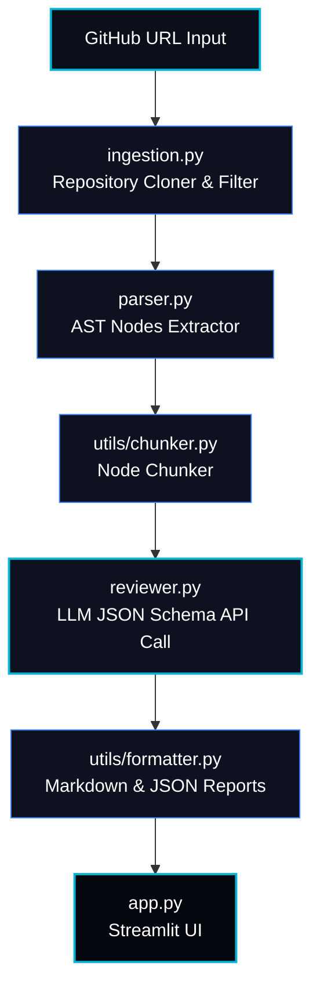

# CodeLens AI: AST-Aware Automated Code Reviewer

<div align="center">

[](https://ai-code-reviewer-vtktnacbukrw87589atwck.streamlit.app/)
[](https://www.python.org/)
[](https://opensource.org/licenses/MIT)

<h3>⚡ Streamlit Dashboard ⚡</h3>

Scan public GitHub repositories instantly in the web dashboard.

👉 **[Launch Code Reviewer Dashboard](https://ai-code-reviewer-vtktnacbukrw87589atwck.streamlit.app/)** 👈

</div>

---

## Why I Built This

I built this because sending an entire repository to an LLM is either too expensive or hits token limits. Slicing source files based on AST boundaries (methods, classes, imports) lets the LLM analyze logical blocks in isolation. This keeps the review targeted, keeps costs low, and makes it easy to map recommendations back to specific lines of code.

## Project Overview

**CodeLens AI** is a tool that reviews code in Python and JavaScript/TypeScript repositories. It clones public GitHub repositories, extracts Abstract Syntax Tree (AST) structures, splits files into logical chunks, requests reviews from LLMs (Groq, OpenAI, or Anthropic), and formats suggestions in JSON.

Each finding includes a confidence score generated by the model. The dashboard separates high-confidence and low-confidence findings to help developers prioritize reviews:
* **High Confidence (>= 50%)**: Displayed on the main review panel.
* **Low Confidence (< 50%)**: Placed in a warning drawer ("Needs Verification") to highlight items that require manual review.

#### 🧠 How Confidence Ratings Work
Confidence ratings (0-100%) are estimated by the selected LLM provider using specific guidelines in the prompts:
* **80% - 100% (High)**: Clear bugs, security vulnerabilities, or definite anti-patterns visible directly in the code.
* **60% - 79% (Medium)**: Likely issues or improvements where code context, framework choices, or design might affect the validity of the suggestion.
* **0% - 59% (Low)**: Stylistic preferences, documentation suggestions, or potential issues requiring manual review.

---

## Review Dashboard

The dashboard is built with Streamlit and displays the review results:

<div align="center">
  
  <p><i>Figure 1: Streamlit Review Dashboard</i></p>
</div>

The dashboard displays summary metrics (total issues, critical and security issues, average confidence score) and allows filtering results by confidence rating.

---

## System Architecture

CodeLens AI uses a modular pipeline to process repositories and execute reviews.



### Module Descriptions
1. **Repository Ingestion (`ingestion.py`)**: Clones the target repository to a local temporary directory, filters supported extensions (Python, JavaScript), and limits the file count to prevent resource exhaustion.
2. **AST Parser (`parser.py`)**: Parses Python files into an Abstract Syntax Tree to identify functional definitions (classes, methods, imports).
3. **Node Chunker (`utils/chunker.py`)**: Slices files into text chunks matching logical AST boundaries to stay within LLM token limits.
4. **LLM Reviewer (`reviewer.py`)**: Submits code chunks to the LLM (Groq, OpenAI, Anthropic) using prompts that enforce strict JSON output matching the target schema.
5. **Dashboard UI (`app.py`)**: A Streamlit web interface displaying findings, files, metrics, and logs.

---

## Design Decisions & Tradeoffs

Below is a breakdown of the core design choices:

### 1. Why AST Parsing?
Instead of treating codebases as raw, flat text files (which leads to unstructured reviews), CodeLens AI compiles Python files into an **Abstract Syntax Tree (AST)** using Python's built-in `ast` module.
* **Structural Context**: Parsing the AST allows the tool to programmatically distinguish between classes, helper functions, and decorator imports.
* **Targeted Analysis**: Rather than sending irrelevant boilerplate or configuration blocks to the LLM, the parser isolates only functional code nodes. This helps the review agent accurately locate line numbers, docstrings, and functional signatures.

### 2. Why Chunking?
Large source files can exceed LLM token limits or dilute the context. CodeLens AI splits files based on AST structure:
* **Token Efficiency**: Slicing the AST into class-level and function-level chunks minimizes prompt size, ensuring the model reviews one logical unit of code at a time.
* **Precise Mapping**: Because the chunks align directly with individual AST nodes, we can map review comments back to the exact methods or classes where they belong.

### 3. Why Confidence Scores?
Filtering by confidence helps separate high-certainty issues from stylistic suggestions:
* **Noise Reduction**: The LLM assigns a confidence rating to each generated comment.
* **Developer Experience**: High-confidence findings ($\ge 50\%$) are displayed as primary items. Lower-confidence suggestions are grouped in a "Needs Verification" section to avoid clutter.

### 4. Why Static Analysis Before LLM?
CodeLens AI runs a fast syntax parsing and local AST compilation pass *prior* to initiating LLM API queries:
* **Immediate Fail-Fast**: If a source file is corrupted, has syntax errors, or cannot be parsed, the system captures the parse error locally without wasting API tokens or causing LLM request timeouts.
* **Contextual Enrichment**: Extracting imports and function signatures statically allows us to inject meta-context into the LLM system prompt. The model is provided with the structural framework of the file, enabling more contextual code analysis.

## Setup & Installation

Follow these steps to run the CodeLens AI developer environment locally:

### 1. Prerequisites
Ensure you have **Python 3.9 or higher** and `git` installed on your system.

### 2. Clone the Repository
```bash
git clone https://github.com/nikhilc1910/ai-code-reviewer.git
cd ai-code-reviewer
```

### 3. Setup Virtual Environment
On Windows (PowerShell):
```powershell
python -m venv .venv
.venv\Scripts\Activate.ps1
```
On Linux/macOS:
```bash
python -m venv .venv
source .venv/bin/activate
```

### 4. Install Dependencies
```bash
pip install -r requirements.txt
```

### 5. Configure Environment Variables
Copy the `.env.example` file and add your credentials:
```bash
cp .env.example .env
```
Open `.env` and fill in your keys:
```env
# Selected review provider (groq, openai, anthropic)
LLM_PROVIDER=groq
LLM_MODEL=llama-3.1-8b-instant

# API Credentials
GROQ_API_KEY=your_groq_api_key_here
OPENAI_API_KEY=your_openai_api_key_here
ANTHROPIC_API_KEY=your_anthropic_api_key_here
```

### 6. Run the Application
Launch the Streamlit web dashboard locally:
```bash
streamlit run app.py
```

### 7. Dry Running with Preset Repositories
To test the application quickly, you can select one of the following preset repositories from the **"Quick Test Presets"** dropdown menu in the sidebar of the live dashboard:

* **Best Overall (Sample Project)**: `https://github.com/pypa/sampleproject`
  * *Perfect for*: Quick smoke testing, verifying standard review output, and general UI demo.
* **Tiny Python (dj-database-url)**: `https://github.com/kennethreitz/dj-database-url`
  * *Perfect for*: Checking minimal execution paths on a real, single-file Python database utility with near-instant analysis.
* **JavaScript Utility (ms)**: `https://github.com/vercel/ms`
  * *Perfect for*: Testing line-based parsing on non-Python repositories.

---

## 🧪 Verification & Testing Suite

CodeLens AI includes a suite of tests to verify pipeline operations before deployment.

### Run Unit Tests
To run unit tests for chunking, parser, ingestion, and reviewer modules:
```bash
python -m pytest tests/
```

### Run End-to-End Integration Test
Run a test that clones a sample repository, parses the files, generates code chunks, calls the LLM, and formats the output comments:
```bash
python smoke_test.py
```

---

## Known Limitations

CodeLens AI operates under the following limits:

* **Static Analysis Only**: Behavior that requires code execution (such as race conditions or runtime environment checks) is not evaluated.
* **LLM-Estimated Confidence**: Confidence ratings are estimated by the LLM. They can vary in consistency and are subject to model limitations.
* **Advisory Suggestions**: Findings should be reviewed manually before merging changes.
* **Single-Repository Scope**: Multi-repository dependency mappings and inter-repository references are not supported.
* **AST Language Constraints**: Abstract Syntax Tree node analysis is currently only implemented for Python. JavaScript and TypeScript files are split using line-based boundaries.
* **Public Repositories Only**: Only public repositories are supported out-of-the-box (uses HTTPS cloning).

---

## Future Roadmap

Planned features for future updates:

1. **🔌 Inline GitHub PR Review Actions**:
   Create a GitHub Action integration that triggers on Pull Requests. Instead of checking out the repo manually, it would analyze only the modified diff lines, map them back to the AST block, and post inline comments directly on the PR code review page.
2. **🌳 Multi-Language Tree-sitter Support**:
   Compile and integrate Tree-sitter grammars (via `py-tree-sitter`) to replace line-based chunking for JavaScript, TypeScript, Go, Rust, and C++ with full AST parsing support.
3. **⚡ Incremental File Caching**:
   Add a local SQLite-backed caching system that calculates SHA-256 hashes of files. On subsequent scans, only modified files are sent to the LLM, reducing API costs and scan times by up to 90%.
4. **🧠 Vector RAG Codebase Assistant**:
   Vectorize all parsed AST chunks using an embedding model and load them into a vector database (e.g. ChromaDB). This would add a "Chat with Codebase" panel, allowing developers to ask conversational questions about the repository's design patterns and software architectures.
5. **📋 Custom Style Rubrics**:
   Allow teams to supply their own markdown-based style guides or secure coding templates, injecting them into the reviewer's prompt context to enforce custom, team-specific engineering rules.

## Contributing Guidelines

Contributions are welcome! Here is how you can help add features and get commits merged:

### 1. Fork and Clone
Click **Fork** on GitHub and clone your fork repository:
```bash
git clone https://github.com/YOUR_USERNAME/ai-code-reviewer.git
cd ai-code-reviewer
git checkout -b feature/new-feature
```

### 2. Verify Your Environment
Always ensure existing tests pass before starting development:
```bash
python -m pytest tests/
python smoke_test.py
```

### 3. Implement Your Changes
* Retain original docstrings and comments.
* Write unit tests in the `tests/` directory for any new module or helper function.

### 4. Run Verification
Before committing, ensure all unit tests and integration steps pass:
```bash
python -m pytest tests/
python smoke_test.py
```

### 5. Commit and Push
```bash
git add .
git commit -m "feat: add tree-sitter chunking for javascript"
git push origin feature/new-feature
```
Open a **Pull Request** on the main repository describing your changes.

---

## Repository Structure

This repository contains two pipeline implementations:
1. **Root-level functional pipeline**: A procedural flow that handles raw dictionaries directly, used by the Streamlit frontend.
2. **OOP-based pipeline** (under `src/`): A layered structure utilizing Pydantic models for data contracts and validation.

Below is the structural mapping of the codebase:

```
ai-code-reviewer/
├── .streamlit/
│   └── config.toml             # Streamlit theme configuration (forces dark background)
├── assets/                     # Graphic resources and screenshots
│   └── dashboard_mockup.png    # Streamlit UI showcase reference
├── docs/                       # Project Documentation
│   └── ARCHITECTURE.md         # High-level architecture, design decisions, and data flows
├── src/                        # Core Enterprise OOP Implementation
│   ├── ingestion/              # Repository cloning logic
│   ├── models/                 # Pydantic schemas (CodeChunk, ReviewComment, ReviewBatch)
│   ├── output/                 # Report generation and GitHub PR integration
│   ├── parsing/                # AST and tree-sitter chunking/parsing implementation
│   ├── pipeline/               # OOP workflow orchestrator
│   └── review/                 # LLM provider connections and prompt templates
├── tests/                      # Python Testing Suite (Pytest framework)
│   ├── test_chunker_module.py  # Unit tests for AST grouping and formatting logic
│   ├── test_ingestion.py       # Unit tests for Git cloning, pathing, and URL security checks
│   ├── test_parser.py          # Unit tests verifying AST parsing for classes and imports
│   ├── test_parser_module.py   # Unit tests checking syntax errors handling and methods discovery
│   ├── test_pipeline_module.py # Unit tests for orchestrator run states and error containment
│   └── test_reviewer_module.py # Unit tests verifying LLM mock responses, validation, and JSON extracting
├── utils/                      # Helper Modules for root functional pipeline
│   ├── chunker.py              # Groups Python AST nodes and formats them under token caps
│   └── formatter.py            # Generates deterministic Markdown/JSON summaries for review findings
├── .env.example                # Blueprint for LLM credentials and environment toggles
├── app.py                      # Streamlit Frontend application (layout structure, tabs routing, styling overrides)
├── ingestion.py                # Root ingestion module (local temporary cloner, file suffix checking)
├── parser.py                   # Root Python AST parsing module (built-in ast nodes lookup, methods mapping)
├── pipeline.py                 # Root pipeline coordination module (executes ingestion -> parser -> chunker -> reviewer)
├── requirements.txt            # Package dependencies manifest
├── reviewer.py                 # Root LLM calling module (supports Groq, OpenAI, Anthropic; validates & clamps comments)
└── smoke_test.py               # 7-step E2E Integration smoke test checking complete lifecycle
```
