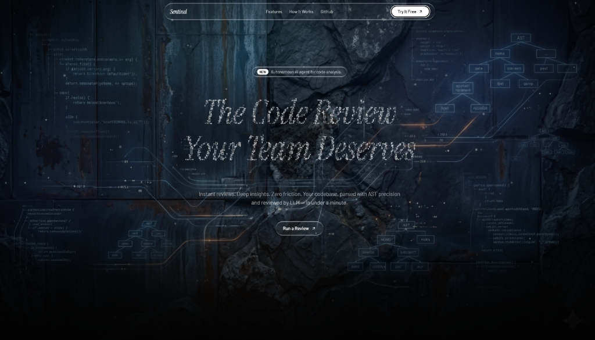
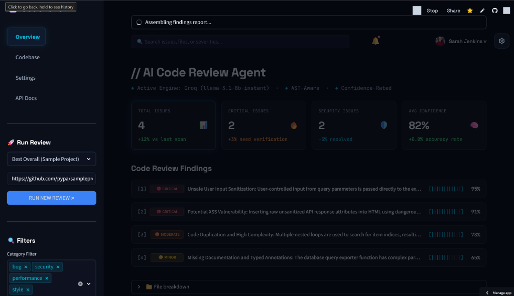
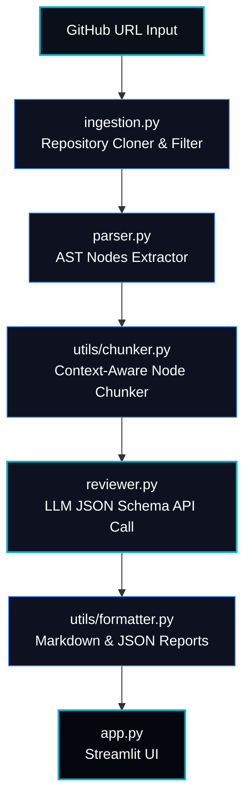

# CodeLens AI: AST-Aware Automated Code Reviewer

<div align="center">

[](https://ai-code-reviewer-vtktnacbukrw87589atwck.streamlit.app/)
[](https://sentinel-complete-site--nikhil19102004.replit.app/)
[](https://www.python.org/)
[](https://opensource.org/licenses/MIT)

<h3>⚡ Try the Live Review Dashboard & Showcase Website ⚡</h3>

Scan public GitHub repositories instantly in the web dashboard, or explore the showcase page.

👉 **[Launch AI Code Reviewer Dashboard](https://ai-code-reviewer-vtktnacbukrw87589atwck.streamlit.app/)** 👈

👉 **[Explore the Sentinel Product Landing Page](https://sentinel-complete-site--nikhil19102004.replit.app/)** 👈

</div>

---

> [!NOTE]
> ### 🌐 Developer Showcase: Sentinel Project Website
> View the live project showcase and portfolio at **[Sentinel Website](https://sentinel-complete-site--nikhil19102004.replit.app/)**. This page showcases the product context, workflows, and integration examples.
> 
> *⚠️ Disclaimer: This portfolio site is temporarily hosted on Replit and will remain active until **June 20, 2026**. Please visit the site before then to inspect the design showcase.*

<div align="center">
  
  <p><i>Figure 1: The Sentinel Product Landing Page - Project Showcase</i></p>
</div>

## 📋 Project Overview

**CodeLens AI** (branded as **Sentinel**) is a code review tool for Python and JavaScript/TypeScript repositories. The tool clones public GitHub codebases, extracts Abstract Syntax Tree (AST) representations for Python files, segments code into logical blocks, executes review passes via LLM endpoints (Groq, OpenAI, Anthropic), and generates structured, schema-validated findings.

A key feature of the tool is its **interactive confidence scoring system**. Every review finding is generated with an LLM self-assessed confidence rating. The dashboard automatically filters and buckets these findings:
* **High Confidence (>= 50%)**: Displayed on the main review panel with progress indicators.
* **Low Confidence (< 50%)**: Segmented into a warning drawer ("Needs Verification") to alert developers that manual verification is needed before acting on the suggestion.

---

## 🖥️ Interactive Review Dashboard

CodeLens AI includes a Streamlit dashboard interface for browsing findings:

<div align="center">
  
  <p><i>Figure 2: CodeLens AI Interactive Streamlit Review Dashboard</i></p>
</div>

> [!NOTE]
> **Interactive Findings Explorer**: The dashboard aggregates key metrics (Total, Critical, and Security Issues, Average Confidence) and displays finding details. A confidence-rating slider allows filtering out low-confidence findings or reviewing them separately.

---

## 🏗️ System Architecture

CodeLens AI uses a modular pipeline to process repositories and execute reviews.



### Module Descriptions
1. **Repository Ingestion (`ingestion.py`)**: Clones the target repository to a local temporary directory, filters supported extensions (Python, JavaScript), and limits the file count to prevent resource exhaustion.
2. **AST Parser (`parser.py`)**: Parses Python files into an Abstract Syntax Tree to identify functional definitions (classes, methods, imports).
3. **Context Chunker (`utils/chunker.py`)**: Slices files into token-efficient text chunks mapping to logical AST boundaries to stay within LLM context limits.
4. **LLM Reviewer (`reviewer.py`)**: Submits code chunks to the LLM (Groq, OpenAI, Anthropic) using prompts that enforce strict JSON output matching the target schema.
5. **Dashboard UI (`app.py`)**: A Streamlit web interface displaying findings, files, metrics, and logs.

---

## 🧠 Design Decisions & Engineering Tradeoffs

Below is a breakdown of the core design choices made during development:

### 1. Why AST Parsing?
Instead of treating codebases as raw, flat text files (which leads to unstructured reviews), CodeLens AI compiles Python files into an **Abstract Syntax Tree (AST)** using Python's built-in `ast` module.
* **Structural Context**: Parsing the AST allows the tool to programmatically distinguish between classes, helper functions, and decorator imports.
* **Targeted Analysis**: Rather than sending irrelevant boilerplate or configuration blocks to the LLM, the parser isolates only functional code nodes. This helps the review agent accurately locate line numbers, docstrings, and functional signatures.

### 2. Why Chunking?
Large source files can easily exceed LLM token limits or cause the model to suffer from "loss-in-the-middle" context window dilution. CodeLens AI uses AST-guided **context-aware chunking**:
* **Token Efficiency**: Slicing the AST into class-level and function-level chunks minimizes prompt size, ensuring the agent only reviews one logical unit of code at a time.
* **Precise Mapping**: Because the chunks align directly with individual AST nodes, we can deterministically map review comments back to the exact code units (e.g. methods) where they belong, keeping the UI metrics clean.

### 3. Why Confidence Scoring?
Self-assessed confidence scoring filters out lower-confidence observations and reduces false positives:
* **Noise Mitigation**: The LLM assigns a confidence score to each generated review comment.
* **Developer Experience**: High-confidence findings ($\ge 50\%$) are displayed as primary items. Lower-confidence suggestions are grouped in a "Needs Verification" section to minimize alert fatigue.

### 4. Why Static Analysis Before LLM?
CodeLens AI runs a fast syntax parsing and local AST compilation pass *prior* to initiating LLM API queries:
* **Immediate Fail-Fast**: If a source file is corrupted, has syntax errors, or cannot be parsed, the system captures the parse error locally without wasting API tokens or causing LLM request timeouts.
* **Contextual Enrichment**: Extracting imports and function signatures statically allows us to inject meta-context into the LLM system prompt. The model is provided with the structural framework of the file, enabling more contextual code analysis.

---

## ⚡ Setup & Installation

Follow these steps to run the CodeLens AI developer environment locally:

### 1. Prerequisites
Ensure you have **Python 3.9 or higher** and `git` installed on your system.

### 2. Clone the Repository
```bash
git clone https://github.com/nikhilc1910/ai-code-reviewer.git
cd ai-code-reviewer
```

### 3. Setup Virtual Environment
On Windows (PowerShell):
```powershell
python -m venv .venv
.venv\Scripts\Activate.ps1
```
On Linux/macOS:
```bash
python -m venv .venv
source .venv/bin/activate
```

### 4. Install Dependencies
```bash
pip install -r requirements.txt
```

### 5. Configure Environment Variables
Copy the `.env.example` file and add your credentials:
```bash
cp .env.example .env
```
Open `.env` and fill in your keys:
```env
# Selected review provider (groq, openai, anthropic)
LLM_PROVIDER=groq
LLM_MODEL=llama-3.1-8b-instant

# API Credentials
GROQ_API_KEY=your_groq_api_key_here
OPENAI_API_KEY=your_openai_api_key_here
ANTHROPIC_API_KEY=your_anthropic_api_key_here
```

### 6. Run the Application
Launch the Streamlit web dashboard locally:
```bash
streamlit run app.py
```

### 7. Dry Running with Preset Repositories
To test the application quickly, you can select one of the following preset repositories from the **"Quick Test Presets"** dropdown menu in the sidebar of the live dashboard:

* **Best Overall (Sample Project)**: `https://github.com/pypa/sampleproject`
  * *Perfect for*: Quick smoke testing, verifying standard review output, and general UI demo.
* **Tiny Python (dj-database-url)**: `https://github.com/kennethreitz/dj-database-url`
  * *Perfect for*: Checking minimal execution paths on a real, single-file Python database utility with near-instant analysis.
* **JavaScript Utility (ms)**: `https://github.com/vercel/ms`
  * *Perfect for*: Testing line-based parsing on non-Python repositories.

---

## 🧪 Verification & Testing Suite

CodeLens AI includes a suite of tests to verify pipeline operations before deployment.

### Run Unit Tests
To run unit tests for chunking, parser, ingestion, and reviewer modules:
```bash
python -m pytest tests/
```

### Run End-to-End Integration Smoke Test
Execute a full simulated pipeline test that clones a sample repository, parses nodes, chunks code, invokes the LLM API, formats output, and validates schemas:
```bash
python smoke_test.py
```

---

## ⚠️ Known Limitations

Acknowledging system boundaries is crucial for production tools. CodeLens AI operates under the following engineering constraints:

* **Static Analysis Only (No Dynamic Runtime)**: The agent analyzes the codebase statically. Dynamic runtime behaviors, race conditions, memory leaks, and runtime environment variable evaluations are not executed or profiled.
* **Heuristic Confidence Scoring**: Confidence ratings are self-assessed heuristics provided by the LLM completion models. They can vary in consistency and are subject to model bias or occasional over-confidence.
* **Required Human Verification**: Code review findings are advisory. Recommendations should not be auto-merged into production branches without manual developer verification and code review.
* **Single-Repository Scope**: Multi-repository dependency mappings and inter-repository references are not supported; the analysis is strictly bounded to the context of the cloned workspace repository.
* **AST Language Constraints**: Deep Abstract Syntax Tree node analysis is currently only implemented for **Python**. JavaScript and TypeScript files are ingested and chunked using line-based boundaries instead of language-specific AST tokens.
* **Public Repository Limit**: The ingestion engine clones repositories using public HTTPS links and does not support SSH key or OAuth token authorization for private repositories out-of-the-box.

---

## 🚀 Future Roadmap: What We'd Build Next

With more development cycles, we would prioritize building the following value-add features:

1. **🔌 Inline GitHub PR Review Actions**:
   Create a GitHub Action integration that triggers on Pull Requests. Instead of checking out the repo manually, it would analyze only the modified diff lines, map them back to the AST block, and post inline comments directly on the PR code review page.
2. **🌳 Multi-Language Tree-sitter Support**:
   Compile and integrate Tree-sitter grammars (via `py-tree-sitter`) to replace line-based chunking for JavaScript, TypeScript, Go, Rust, and C++ with full AST parsing support.
3. **⚡ Incremental File Caching**:
   Add a local SQLite-backed caching system that calculates SHA-256 hashes of files. On subsequent scans, only modified files are sent to the LLM, reducing API costs and scan times by up to 90%.
4. **🧠 Vector RAG Codebase Assistant**:
   Vectorize all parsed AST chunks using an embedding model and load them into a vector database (e.g. ChromaDB). This would add a "Chat with Codebase" panel, allowing developers to ask conversational questions about the repository's design patterns and software architectures.
5. **📋 Custom Style Rubrics**:
   Allow teams to supply their own markdown-based style guides or secure coding templates, injecting them into the reviewer's prompt context to enforce custom, team-specific engineering rules.

---

## 🤝 Contributing Guidelines

Contributions are welcome! Here is how you can help add features and get commits merged:

### 1. Fork and Clone
Click **Fork** on GitHub and clone your fork repository:
```bash
git clone https://github.com/YOUR_USERNAME/ai-code-reviewer.git
cd ai-code-reviewer
git checkout -b feature/your-awesome-feature
```

### 2. Verify Your Environment
Always ensure existing tests pass before starting development:
```bash
python -m pytest tests/
python smoke_test.py
```

### 3. Implement Your Changes
* Retain original docstrings and comments.
* Write unit tests in the `tests/` directory for any new module or helper function.

### 4. Run Pre-commit Verification
Before committing, ensure your styling is clean and all 84+ unit tests and 7 integration steps are completely green:
```bash
python -m pytest tests/
python smoke_test.py
```

### 5. Commit and Push
```bash
git add .
git commit -m "feat: add tree-sitter chunking for javascript"
git push origin feature/your-awesome-feature
```
Open a **Pull Request** on the main repository describing your feature, findings, and verification runs!

---

## 📁 Repository Structure & Architectural Representation

This repository contains two pipeline implementations to compare different software design paradigms:
1. **Lightweight Functional/Procedural Pipeline** (Directly in root): Optimized for simplicity, performance, and immediate execution, direct dictionary transformations, and integration with the Streamlit frontend.
2. **Enterprise Layered OOP Pipeline** (Under `src/` & `agent/` adapters): Built with structured domain data contracts (Pydantic models), formal type signatures, dependency injection, and clean modular decoupling.

Below is the structural mapping of the codebase:

```
ai-code-reviewer/
├── .streamlit/
│   └── config.toml             # Streamlit theme configuration (forces dark background)
├── agent/                      # Layered OOP Pipeline Re-exporters
│   ├── __init__.py             # Module boundaries for agent subcomponents
│   ├── ingestion.py            # Adapter importing and exposing src.ingestion components
│   ├── parser.py               # Adapter importing and exposing src.parsing components
│   ├── pipeline.py             # Adapter importing and exposing src.pipeline coordinates
│   └── reviewer.py             # Adapter importing and exposing src.review components
├── assets/                     # Graphic resources and screenshots
│   ├── dashboard_mockup.png    # Streamlit UI showcase reference
│   └── sentinel_landing.jpg    # Sentinel complete showcase website screenshot
├── tests/                      # Python Testing Suite (Pytest framework)
│   ├── test_chunker_module.py  # Unit tests for AST grouping and formatting logic
│   ├── test_ingestion.py       # Unit tests for Git cloning, pathing, and URL security checks
│   ├── test_parser.py          # Unit tests verifying AST parsing for classes and imports
│   ├── test_parser_module.py   # Unit tests checking syntax errors handling and methods discovery
│   ├── test_pipeline_module.py # Unit tests for orchestrator run states and error containment
│   └── test_reviewer_module.py # Unit tests verifying LLM mock responses, validation, and JSON extracting
├── utils/                      # Helper Modules for root functional pipeline
│   ├── chunker.py              # Groups Python AST nodes and formats them under token caps
│   └── formatter.py            # Generates deterministic Markdown/JSON summaries for review findings
├── .env.example                # Blueprint for LLM credentials and environment toggles
├── app.py                      # Streamlit Frontend application (layout structure, tabs routing, styling overrides)
├── ingestion.py                # Root ingestion module (local temporary cloner, file suffix checking)
├── parser.py                   # Root Python AST parsing module (built-in ast nodes lookup, methods mapping)
├── pipeline.py                 # Root pipeline coordination module (executes ingestion -> parser -> chunker -> reviewer)
├── requirements.txt            # Package dependencies manifest
├── reviewer.py                 # Root LLM calling module (supports Groq, OpenAI, Anthropic; validates & clamps comments)
└── smoke_test.py               # 7-step E2E Integration smoke test checking complete lifecycle
```

---

## 📁 References & Citations

All third-party testing source codes and repositories utilized during development and testing are listed below:
* **Sample Project (PyPA)**: `https://github.com/pypa/sampleproject` (A simple Python packaging example used for smoke testing).
* **Hello World (Octocat)**: `https://github.com/octocat/Hello-World` (A minimal repository used to test pipeline boundaries).
* **Flask App Tutorial (Pallets)**: `https://github.com/pallets/flask/tree/main/examples/tutorial` (Flask database application example used to verify security and code-style findings).
* **FastAPI Docs (FastAPI)**: `https://github.com/fastapi/fastapi/tree/master/docs_src/first_steps` (Used to evaluate FastAPI source structures).
* **MS Javascript Utility (Vercel)**: `https://github.com/vercel/ms` (Used to check raw line-based chunk boundaries for non-Python repositories).
